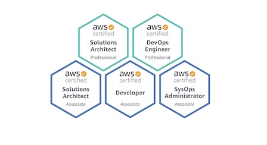

## Hello!

My name is Jose Castaneyra, and I'm a Software Engineer (previously for a couple of years a Cloud Engineer).

As a Software Engineer, I work with different technologies. I have to say that I am always learning, so I would say that I am a generalist and avid learner, mainly on technologies like Java, Python, Javascript, Ruby, Spring, Rails, React, Amplify, AWS, etc.

During my journey as a Cloud Engineer, I got five AWS certifications; the last two certs are Solutions Architect - Professional and Certified DevOps Engineer - Professional, see them in [youracclaim.com](https://youracclaim.com/users/jose-juan-castaneyra-matus).

In this blog, I want to share some technical content about what I am passionate about; this mainly would help me to have saved notes for me in the future, but also could help others.

Do you want to send a message? Reach me out on [twitter](https://twitter.com/jcastaneyra).

HEY!! in case you are looking my old blog, you can find it here => [http://old.jcastaneyra.com](http://old.jcastaneyra.com).

