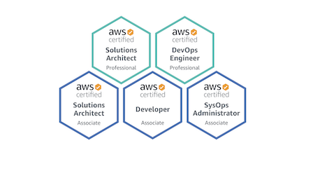

## Hola!

Mi nombre es Jose Castaneyra, y soy un Software Engineer (previamente y por un par de años Cloud Engineer).

Como Software Engineer trabajo con diferentes tecnologías, aunque tengo que decir que siempre estoy aprendiendo, así que diría que soy un generalista y un apasionado por aprender, principalmente en tecnologías como Java, Python, Javascript, Ruby, Spring, Rails, React, Amplify, AWS, etc.

Durante mi tiempo como Cloud Engineer, obtuve cinco certificaciones de AWS; las últimas dos certificaciones fueron Solutions Architect - Professional y Certified DevOps Engineer - Professional, puedes verlas en [youracclaim.com](https://youracclaim.com/users/jose-juan-castaneyra-matus).

En este blog, quiero compartir algo de contenido técnico acerca de lo que me apasiona; esto principalmente me ayudaría en tener estas notas para usarlas en el futuro, pero además podría ayudar a otras personas.

¿Quieres mandarme algún mensaje? Envíame un mensaje a través de [twitter](https://twitter.com/jcastaneyra).

Hey!! En caso de que estés buscando mi blog anterior, lo puedes encontrar aquí => [http://old.jcastaneyra.com](http://old.jcastaneyra.com).

