Photo from this [AWSAmplify tweet](https://twitter.com/AWSAmplify/status/1101868014805413888)

A few weeks ago, I decided that I should re-do my blog; before creating my new stack for my blog, I researched my options. Currently, there are a lot of options, Jekyll (my old blog was in Jekyll), Hugo, Gatsby, Next.js, and a lot more.

And well, I decided at the end to go with Gatsby and AWS Amplify console; the main reasons were Amplify console and React, I just wanted to experiment a little bit more on these technologies.

## What is Gatsby?

Gatsby is a framework for dynamic static website generation; it uses React for the front-end and GraphQL for the queries to bring all the dynamic content and has many plugins and starters to help you out to build very fast.

## Requirements

For this small tutorial, there are some minimal requirements:

- Node version 10, Gatsby has an excellent tutorial on installing nvm and node 10 (https://www.gatsbyjs.com/tutorial/part-zero/)
- GitHub account, and a repo to upload your code (https://github.com/)
- AWS account (https://aws.amazon.com/)
- Maybe a domain bought through Route53

## The setup

Go to the terminal and be sure you have node version 10. To install Gatsby in your system, run:


```bash
npm install -g gatsby-cli
```

As I mentioned, Gatsby has many plugins and starters that can help you build very fast; in this case, after reviewing different starters https://www.gatsbyjs.com/starters/?v=2 I decide to go with [gatsby-starter-hello-friend](https://www.gatsbyjs.com/starters/panr/gatsby-starter-hello-friend/). To use this starter and create a new project, just run:


```bash
gatsby new gatsby-blog https://github.com/panr/gatsby-starter-hello-friend
```

Change to the project directory just created

```bash
cd gatsby-blog
```

And run

```bash
gatsby develop
```

After running this command, in the terminal you get output about compilation and the URL in your localhost, you should see something like http://localhost:8000, grab this URL and open it in your browser.


Until this point, you have the basic setup using this starter.


## Customize it

I like the starters because you can review which start you want the most and adapt to your needs, take it, and customize it; all this is done in a few minutes.


At this stage, I got Visual Studio Code and started to review the code and make some modifications.


1. I did modify `src/posts/hello.md` and create my first post, it is straightforward.
2. I updated `src/pages/about.md` and removed `src/pages/showcase.md` and `src/posts/example.md`, also I added some new images to `src/images` to be used in the modified page and post.
3. I modified siteMetadata at `gatsby-config.js` file.


At this point, I restart `gatsby develop` command and now my blog with starter looks like this:


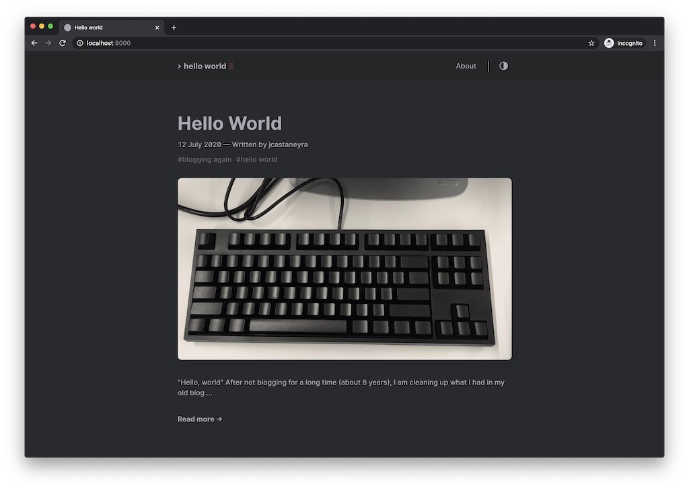


With this minimal version, I think it is ready to be published, but before doing this, push to GitHub.


## Push changes and deploy

Now with this minimal version, you can push your code with:

```bash
git push
```


In my case, I have my code in https://github.com/jcastaneyra/gatsby-blog, as a disclaimer, at this moment some code in my repo is not the best, but for now this code works, it is still a work in progress.


Now, go to [AWSAmplify console](https://console.aws.amazon.com/amplify), go to "GET STARTED" below "Deploy":

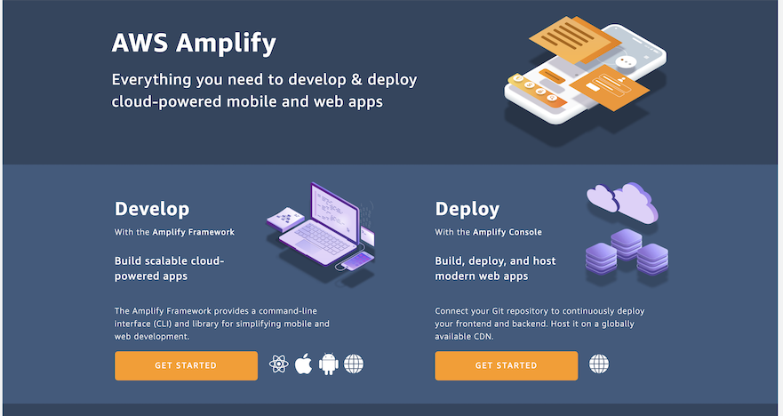

Select GitHub and press "Continue":

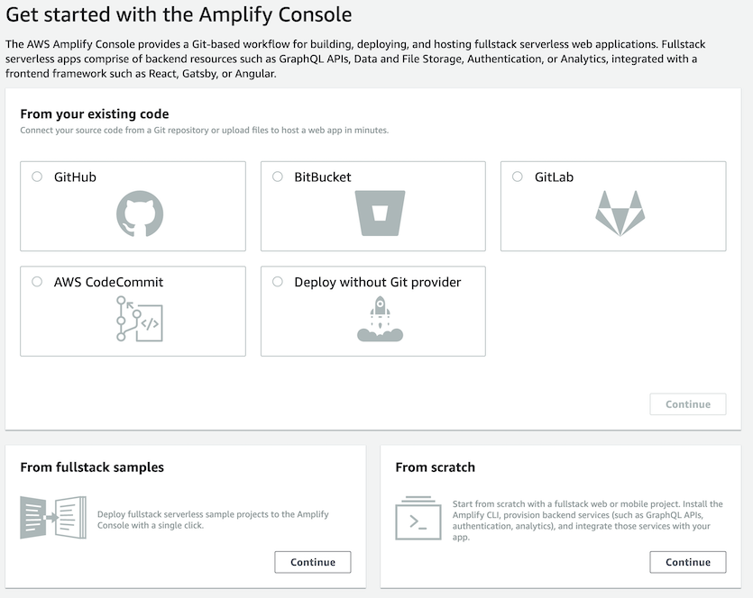

You would require to connect your GitHub account with AWS Amplify. Once GitHub and Amplify are connected, select the repo and the branch, press "Next".

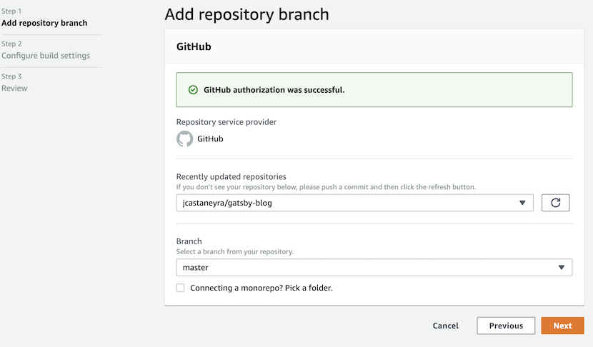

Write an App name, and press "Next".

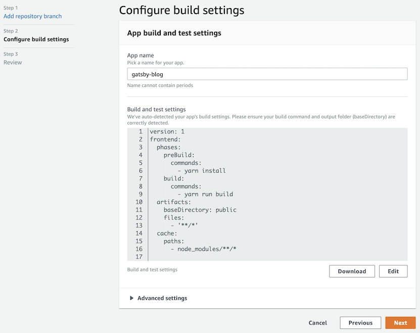

Review Repository details and App settings and press "Save and deploy".

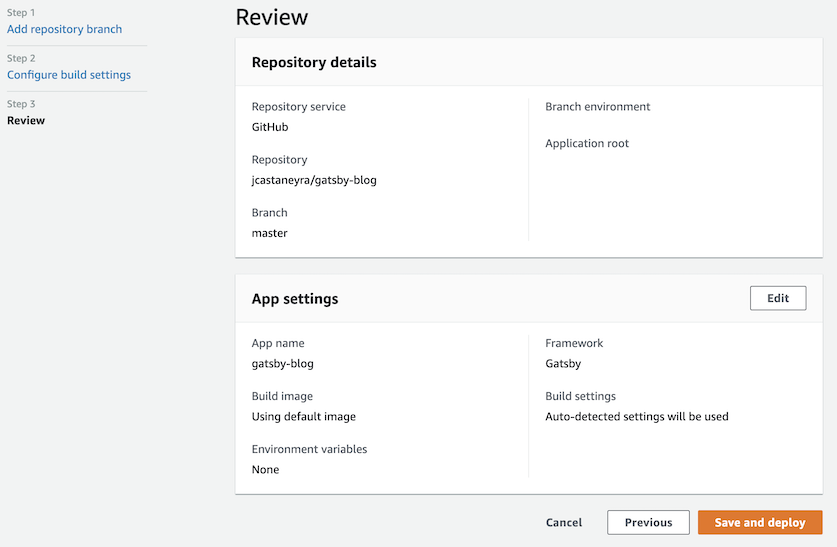

Amplify console will show the status of the deployment, you will see something like this.

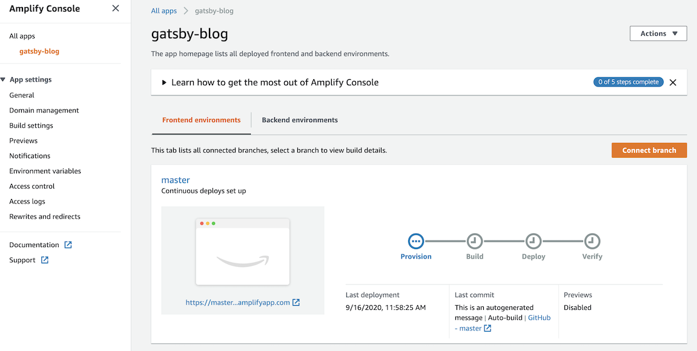


## Get your domain in Route53

Go to [Route53 console](https://console.aws.amazon.com/route53/), and click below Domains on "Registered domains" press in the "Register Domain" button, you would search a domain you would like to buy, the console would guide you to fill all required info and buy the domain.

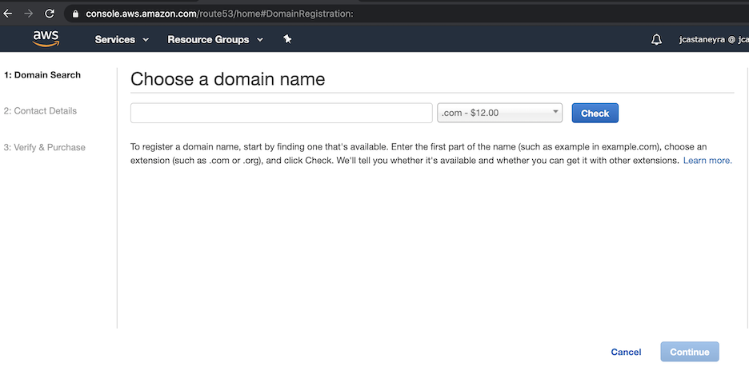

## Assign a domain to the app

Once the app is deployed with Amplify console, you will see some extra steps. One of these steps is "Add a custom domain with a free SSL certificate", click on this step.

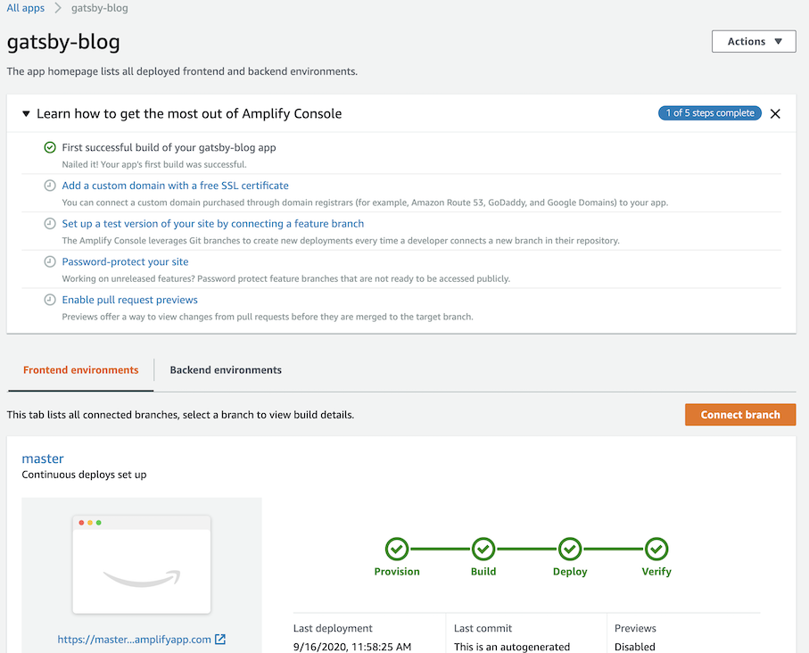

After clicking, you will see something like this.

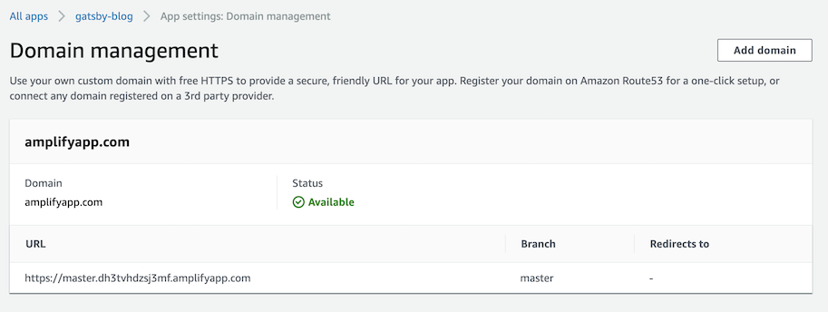

Press "Add domain", choose your domain and configure, press "Save".

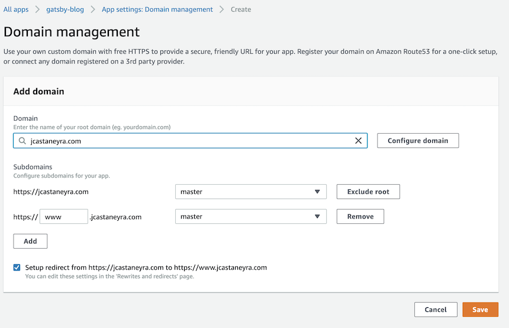

Amplify console would assign and generate certificates through AWS Certificate Manager.

After a while, you would have a blog site with your domain, and AWS Amplify console would have a CI/CD (Continuous Integration/Continuous Deployment) for your application, with every commit to the branch associated with the app will trigger the deployment, and with SSL, excellent.

## Wrap up

I know there are other services to deploy, such as Netlify and Vercel; I think I must test them in the future.

For now, AWS Amplify console works for me; maybe because I feel comfortable with AWS and have been working with it for several years, it is fast to bring my web sites online, including the domain and the SSL certificate.

Do you have comments? Go to [dev.to](https://dev.to/jcastaneyra/your-blog-with-gatsby-aws-amplify-and-a-domain-in-route53-in-a-few-minutes-21dg) or in [medium](https://medium.com/@jcastaneyra/your-blog-with-gatsby-aws-amplify-and-a-domain-in-route53-in-a-few-minutes-40aed7753bd6?sk=7540e6b49f256ba731eed8470d3d62ce)