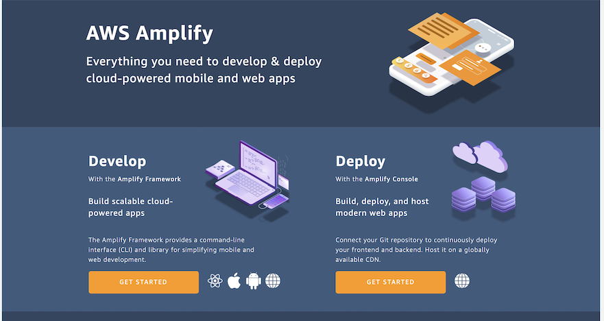
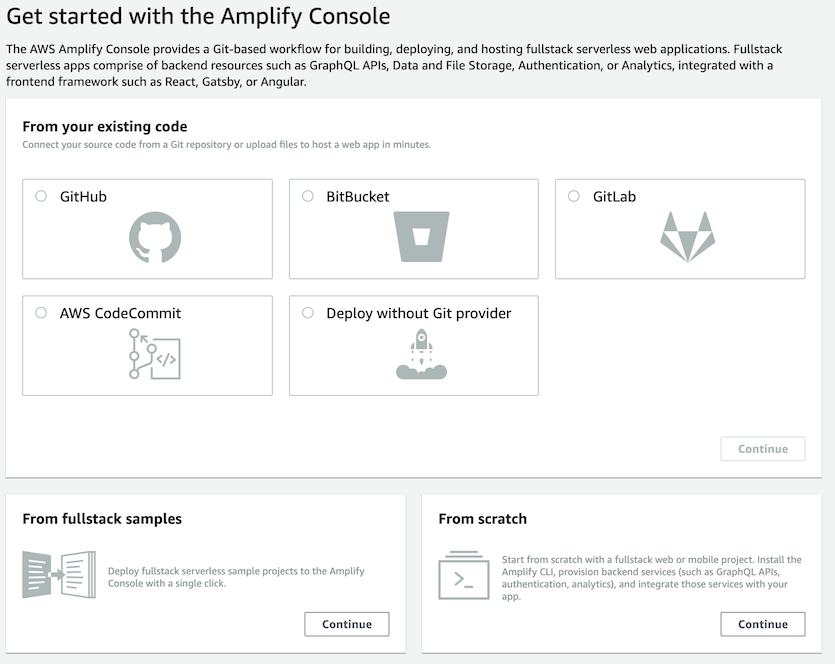
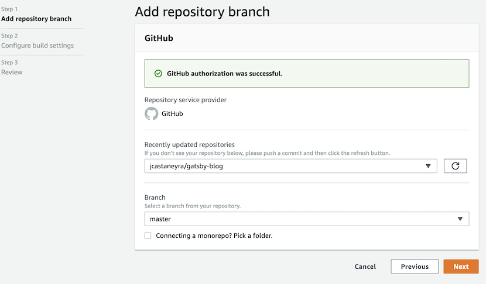
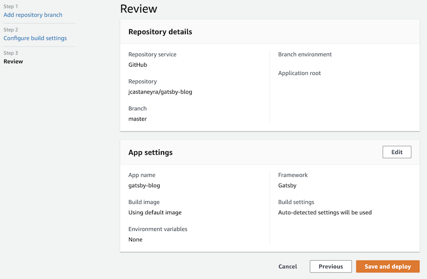
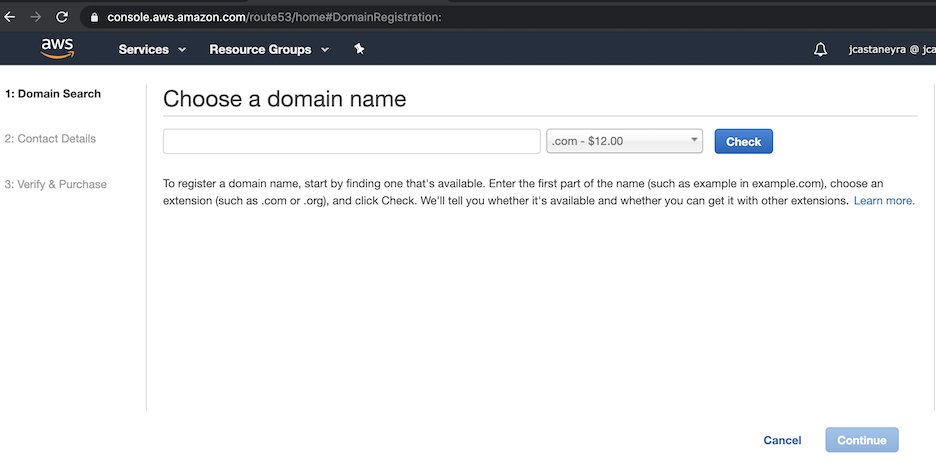
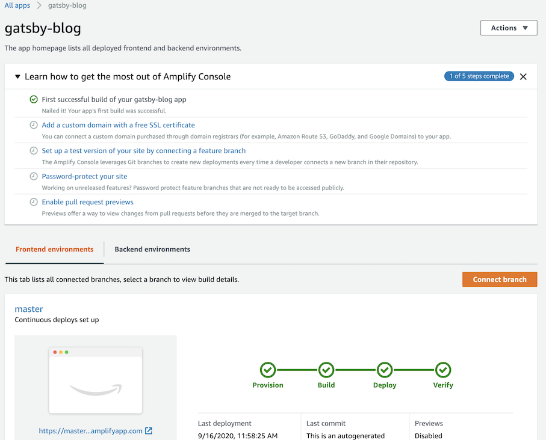
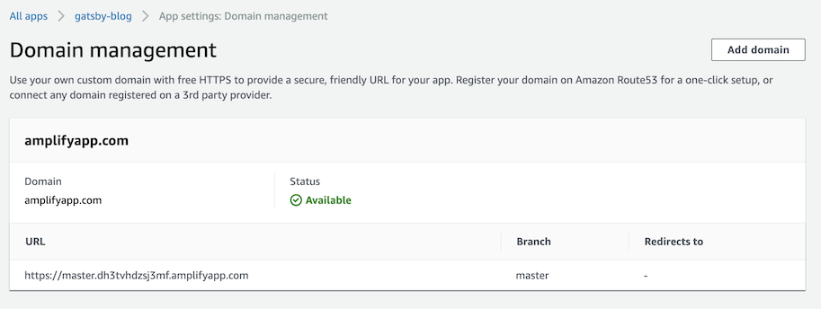
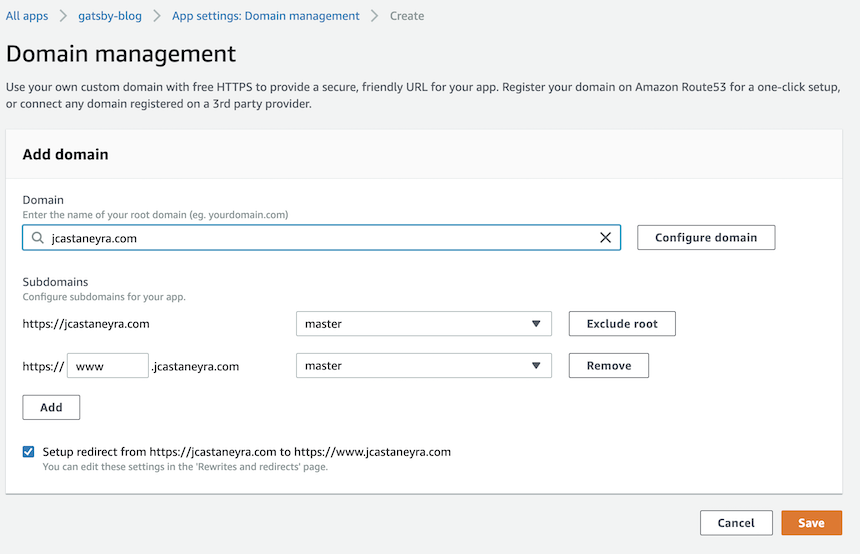

La foto la obtuve de este [tweet de AWSAmplify](https://twitter.com/AWSAmplify/status/1101868014805413888)

Hace unas semanas, decidí que debería rehacer mi blog, pero antes de crear el nuevo stack para mi blog, hice algo de investigación. Actualmente hay bastantes opciones para contenido estático, Jekyll (mi blog viejo estaba en Jekyll), Hugo, Gatsby, Next.js y varios más.

Al final me decidí por Gatsby y AWS Amplify; la razón principal fue que quería experimentar un poco más con tecnologías como React y Amplify console, además de que tenía un poco de contacto con Gatsby.

## ¿Qué es Gatsby?

Gatsby es un framework para generación de sitios de contenido estático y dinámico, está basado en React para el front-end y GraphQL para la parte de queries y contenido dinámico; además tiene bastantes plugins y starters que pueden ayudar a tener una construcción rápida.

## Requerimientos

Para este tutorial, es necesario algunos requerimientos mínimos:

- Node versión 10, Gatsby tiene un tutorial excelente de como instalar nvm y node 10, lo puedes ver aquí (https://www.gatsbyjs.com/tutorial/part-zero/)
- Cuente de GitHub, y un repositorio para subir tu código (https://github.com/)
- Cuenta de AWS (https://aws.amazon.com/)
- Quizá un dominio comprado a través de Route53

## Configuración

Abre una terminal y debes estar seguro de tener node versión 10. Para instalar Gatsby en el sistema, se deberá correr:

```bash
npm install -g gatsby-cli
```

Como mencioné, Gatsby tiene muchos plugins y starters que pueden ayudar a tener una construcción rápida, en este caso, después de revisar diferentes starters en https://www.gatsbyjs.com/starters/?v=2, decidí ir con [gatsby-starter-hello-friend](https://www.gatsbyjs.com/starters/panr/gatsby-starter-hello-friend/). Para usar este starter y crear un nuevo proyecto, solo se necesita correr:

```bash
gatsby new gatsby-blog https://github.com/panr/gatsby-starter-hello-friend
```

Cambiarse al directorio recién creado

```bash
cd gatsby-blog
```

Y correr

```bash
gatsby develop
```

Después de correr este comando, en la terminal se tendría la salida acerca de la compilación y la URL en el localhost, se debería ver algo como http://localhost:8000, abrir esta URL en un browser.

En este punto, ya se tiene una configuración básica con el starter.

## Personalizar

Me gustan los starters porque puedes revisar y escoger el que más te guste y se adapte a tus necesidades, y personalizarlo en tan solo algunos minutos.

Ya con mi Visual Studio Code, comencé a revisar el código y a hacer unas modificaciones.

1. Modifiqué `src/posts/hello.md` y creé mi primer post, realmente fácil.
2. Actualicé `src/pages/about.md` y removí  `src/pages/showcase.md` y `src/posts/example.md`, también agregué algunas imágenes nuevas a `src/images` para ser usadas en la página modificada y en el nuevo post.
3. Modifiqué siteMetadata en el archivo de `gatsby-config.js`.

Ahora, se reinicia el comando de `gatsby develop` y el blog con el starter luce de esta manera:


Con esta versión mínima ya podría ser publicado, pero antes habría que subir el código a GitHub.

## Subir cambios y desplegar

Con esta versión mínima, se puede subir el código con:

```bash
git push
```

En mi caso, tengo mi código en https://github.com/jcastaneyra/gatsby-blog, como nota, en este momento tengo código en mi repo del cual no me siento tan orgulloso, pero de momento funciona y debo decir que este código es aún trabajo en progreso.

Ahora, ir a [AWSAmplify console](https://console.aws.amazon.com/amplify), hacer click en "GET STARTED" debajo de "Deploy":



Seleccionar GitHub y presionar "Continue":



Se requerirá conectar la cuenta de GitHub con AWS Amplify. Una vez que estén conectados, seleccionar el repositorio y la rama de código, presionar "Next".



Escribier el nombre de la App, y presionar "Next".


Revisar los detalles de repositorio, y los settings de la App, presionar "Save and deploy".



En Amplify console se mostrará el status del deployment, se podrá ver algo como esto:


## Obtener el dominio en Route53

Ir a la [consola de Route53](https://console.aws.amazon.com/route53/), y hacer click debajo de Domains en "Registered domains", presionar en el botón de "Register Domain", podrás buscar y dominio que quieras comprar, la consola te guiaría y pediría la información necesaria para poder comprar el dominio.



## Asignar el dominio a la App

Una vez que la app se desplegó con la consola de Amplify, verás una sección de pasos extras, uno de estos pasos dice "Add a custom domain with a free SSL certificate", da click sobre este paso.



Después de dar click, verás algo como lo siguiente.



Presiona "Add domain", escoge el dominio y configura que subdominios se requieren, presionar "Save".



Amplify console asignará y generará los certificados a través de AWS Certificate Manager.

Después de un rato se tendrá el sitio del blog con el dominio, y AWS Amplify console te daría un CI/CD (Continuous Integration/Continuous Deployment) para el blog, con cada commit a la rama asociada el despliegue de disparará, y además todo esto con SSL.

## Finalizando

Se que hay otros servicios para poder desplegar y manegar sitios estáticos, algunos como Netlify y Vercel, los cuales estoy seguro deberé probar en el futuro.

Aunque, por ahora AWS Amplify console funciona para mi, tal vez porque me siento cómodo con AWS y porque he trabajado con los servicios de AWS por mucho tiempo, además es rápido esta forma de subir sitios web, inclyendo el dominio y el certificado SSL.